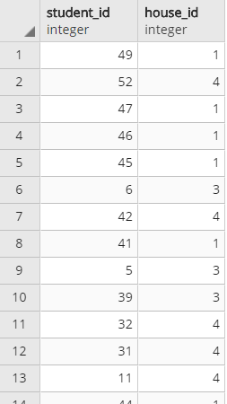

# PostgreSQL Tutorial

### Introduction
In this tutorial, we will write **queries** to fetch data from our database and answer questions about Hogwart's students, teachers, classes, etc, during Harry's fifth year. This is a fun tutorial for any Harry Potter fan!

The **schema diagram** displays our tables and their fields. For example, the `classes` table contains the columns `class_id`, `class name`, and 	`prof_id`. The arrows connect the columns that correspond between tables. For example, the `enrollment` table contain a `class_id` column that correspond to the `class_id` column of the `classes` table. Part of the `classes` and `enrollment` tables are shown below the schema.


   

Let's get started!


### Basic Queries
The **SELECT** statement allows you to specify which columns you want to fetch from a table, which you specify with **FROM**. For example, the query below will return all the columns from the students table. Note that `*` indicates that you want to fetch all the columns.

```
SELECT *
FROM students;
```

With the **WHERE** statement, you can include only certain rows that meet a specified condition. The query below will return all the columns of `students`, but it will filter only the rows that have the last name of Weasley.

```
-- which Weasley's are at Hogwarts right now? --
SELECT *
FROM students
WHERE last_name = 'Weasley';
```


The **ORDER BY** statement allows you to rearrange the order of the rows by the ascending or descending values of a specified column/columns. Ascending is the default, but you can write `DESC` to order by the descending values of a column. In this query we fetch the first name, last name, and year of the Weasleys and list them by highest to lowest of their year.

```
-- order the Weasleys by their years, descending--
SELECT first_name, last_name, year
FROM students
WHERE last_name = 'Weasley'
ORDER BY year DESC;
```


Use the **AND** operator to filter rows with more than one condition and use **BETWEEN** to specify a range of values. Here we find the first name, last name, and year of the Weasleys whose year is between 5 and 7.

```
-- find the older Weasleys (year 5 or above) --
SELECT first_name, last_name, year
FROM students
WHERE last_name = 'Weasley'
AND year
BETWEEN 5 AND 7;
```


The data has missing values for some observations in the `year` and `house_id` column. They are labeled as NULL, so we can use **IS NULL** to find these values. The query below fetches all the columns from the `students` table where the rows have either a `NULL` value in the `year` or `house_id` column (or both). Note that **OR** indicates that only one of the statements in the `WHERE` clause needs to be true in order for the entire condition to be true. The query output shows all the students whose year or house we do not know.

```
-- who are we uncertain of their year or house --
SELECT *
FROM students
WHERE year IS NULL
OR house_id IS NULL;
```


The **LIKE** operator is used with `%` or `_` symbols in the  `WHERE` clause to find a pattern of text. For example `%di%` would represent any word that has `di` inside, such as `riddikulus` or `diffindo`. Instead of `%`, you may also use `_` if you want to represent just a single character. For example `no_` could represent `nox`. In this query we find the professors whose name starts with `S`.

```
-- find professors whose names start with s --
SELECT *
FROM professors
WHERE prof_name LIKE 'S%';
```


**COUNT** is an aggregate function that will calculate the number of rows in a table or data column. Other aggregate functions include `MIN`,`MAX`,`SUM`,`AVG`, which calculate the minimum, maximum, sum, and average respectively.  Here, we use `COUNT` with `SELECT`, which would result in the number of observations in our `dums_army` table in a column called `count`. There's 29 members of Dumbledore's Army- that's a lot of brave students!

```
-- how many people are in Dumbledore's Army? --
SELECT COUNT(*)
FROM dums_army;
```


**GROUP BY** will help you group data into different categories based on unique values of a column. In the query below, we group the students into the two values (M or F) of the `sex` column, and we use `COUNT` to count how many males and female students there are.

```
-- how many female and male students are there? --
SELECT sex, COUNT(*)
FROM students
GROUP BY sex;
```


Similar to `WHERE`, the **HAVING** clause will filter out rows based on a specified condition, but only on groups created by `GROUP BY`. For example, in this query we first group the `students` table by `house_id` and count the number of students per house. Then we use `HAVING` to filter the `house_id` that has more than 10 students.

```
-- which house has more than 10 students in it? --
SELECT house_id, COUNT(first_name)
FROM students
GROUP BY house_id
HAVING COUNT(first_name) > 10;
```


### More Advanced Queries
We will take a quick break from the Harry Potter examples to learn about joins. We can join two tables into one based on matching values between a specified column of the first table and a specified column of the second table. This is best seen diagrammatically.

Imagine we have two tables called `table1` and `table2`. We will join these tables based on each of their `id` columns.


For an **INNER JOIN**, only the values of `id` that both tables contain will show up in the resulting table, along with their corresponding `value1` and `value2` columns. The syntax for this join is shown below. Note that you put the column that you want to match between tables with `USING (<insert column>)`. If the names of the column you want to use to match are not the same between tables, use the syntax `ON table1.columnname1 = table2.columnname2` instead.

```
SELECT *
FROM table1
INNER JOIN table2
USING (id);
```
As you can see, only the id values 2 and 3 are in the resulting table since those were the only two that were present in both of the original tables. The corresponding values of `value1` and `value2` are also added.


For LEFT and RIGHT joins, it matters which tables you specify first in your query. The first table you write would be considered the left table and the second the right table.

For a **LEFT JOIN**, if the specified column of the right table does not have a matching value in the left table, then the added columns of the right table will have `NULL values` for those non-matching values. The syntax of the `LEFT JOIN` is similar to an `INNER JOIN`.

```
SELECT *
FROM table1
LEFT JOIN table2
USING (id);
```

In this result, all the values of the `id` column of `table1` (our left table) are present. Since `table2` did not have an `id` value of 1, its added column `value2`, contains a `NULL` value. Note that the `id` value of 4 of `table2` is not present, since the `LEFT JOIN` only keeps the column the left table.


A **RIGHT JOIN** is the opposite of a `LEFT JOIN`. If the specified column of the left table does not have a matching value in the right table, then the added columns of the left table will have NULL values for those non-matching values.

```
SELECT *
FROM table1
RIGHT JOIN table2
USING (id);
```

In this case all the `id` values of `table2` (our right table) are shown, and for those `id` values that `table1` does not have, there is a `NULL` in `value1`


A **FULL JOIN** will show the outputs of both the `LEFT JOIN` and `RIGHT JOIN`. In the output below, note that both `id` columns are shown (rather than just one) and that where the `id` values do not match between tables there is a `NULL` in both the `id` column and their respective `value1` or `value2` column.

```
SELECT *
FROM table1
FULL JOIN table2
USING (id);
```


With a **CROSS JOIN**, for every row of the first table you will get all the values of the columns of the second table. Thus, you will not have to specify a column to match between tables.

```
SELECT *
FROM table1
CROSS JOIN table2;
```


Back to our Harry Potter examples!


 In order to find out which professor is teaching Defense Against the Dark Arts, we need to first join the tables `professors` with `classes`, matching on their `prof_id` columns. Since both tables have the same unique `prof_id` values, there will be no difference if we use `INNER JOIN`, `LEFT JOIN`, or `RIGHT JOIN`. We will use an `INNER JOIN` in this case, shown below. The first three columns of the resulting join are in the original `professors` table, and the last two were added from the `classes` table.

```
-- INNER JOIN professors and classes --
SELECT *
FROM professors
INNER JOIN classes
USING (prof_id);
```


To answer our question about who is the Defense Against the Dark Arts professor, in addition to the join we selected the `prof_name` column and used `WHERE` to specify the class we want. It's Umbridge...

```
-- which teacher teaches Defense Against the Dark Arts? --
SELECT prof_name
FROM professors
INNER JOIN classes
USING (prof_id)
WHERE class_name = 'Defense Against the Dark Arts';
```


Recall that if the two columns you want to match between two tables do no have the same name, use the syntax `ON table1.columnname1 = table2.columnname2`. If your table names are long, you can use `AS` to give your table a shorter alias (nickname).

Now let's imagine that the `houses` table had a column called `house_number` rather than `house_id`. Here we joined the `students` table to `houses`, renamed `s` and `h` respectively, and matched based `house_id` column with `house_number`.

```
-- how many students are in Gryffindor? --
SELECT COUNT(*)
FROM students AS s
INNER JOIN houses AS h
ON s.house_id = h.house_number
WHERE house_name = 'Gryffindor';
```


Let's find out if there are Slytherins who are not purebloods. We want to join `students` and `blood_line` together. Since `blood_line` does not contain all the `student_id` values that `students` has (students whose mother, father, and bloodtype were all unknown were not entered into the database), we choose to use a **LEFT JOIN** with `students` as our left table so that we see all the possible students in the result. Those who have `NULL` in the `blood_type` column of the resulting table we can interpret as having an unknown blood type (J.K. Rowling did not mention blood types of all the characters). The join and some of the output is shown below.

```
-- students LEFT JOIN blood_line --
SELECT *
FROM students
LEFT JOIN blood_line
USING (student_id);
```


In addition to the query above, we also joined `houses` and used `WHERE` to find the Slytherins who are not purebloods. We find that there are two half blood Slytherins and two Slytherins whose bloodtype is unknown. Note that `!=` means "does not equal" and we use parenthesis carefully around `OR` to separate the first blood_type condition from the `AND` operator.

```
-- are all Slytherins purebloods? --
SELECT first_name, blood_type, house_name
FROM students
LEFT JOIN blood_line
USING (student_id)
INNER JOIN houses
USING (house_id)
WHERE house_name = 'Slytherin' AND
	(blood_type != 'pure'
	OR blood_type ISNULL);
```


Recall **RIGHT JOIN** works the same as `LEFT JOIN`, except that a `RIGHT JOIN` keeps all the values of the right table. Thus, if we simply switched the order of the tables in the query statement and used a `RIGHT JOIN.`, the output would be the same, as seen below.

```
-- equivalent--
SELECT first_name, blood_type, house_name
FROM blood_line
RIGHT JOIN students
USING (student_id)
INNER JOIN houses
USING (house_id)
WHERE house_name = 'Slytherin' AND
	(blood_type != 'pure'
	OR blood_type ISNULL);
```


We can create a new column based on the values of another using the **CASE WHEN and THEN** statement. If the value of a column satisfies the condition after `WHEN`, then value of the new column is assigned to the value after `THEN`. If the condition is false, it will move on to the next `WHEN` and `THEN`. If none of the conditions are satisfied, the value of the new column will be assigned to result of `ELSE`. `END` ends the `CASE` statement.

In the query below, we created a new column called `experience_level` with values 'new', 'some experience', and 'much experience' based on the number of years each professor taught. We grouped professors by experience level to see that 4 professors had much experience, 2 had some, and 5 were new at teaching.
```
-- how many teachers are classified as new, some experience, and much experience --
SELECT COUNT(*),
	CASE WHEN num_years>0 AND num_years<=5 THEN 'new'
	WHEN num_years>5 AND num_years<=15 THEN 'some experience'
	ELSE 'much experience' END
	AS experience_level
FROM professors
GROUP BY experience_level;
```


Simply put, **subqueries** are queries inside queries. In the query below, the subquery is in the `WHERE` clause of the outer query. In the subquery, we found the average number of years that professors taught. In the outer query, we selected the professors who taught for longer than above the average years. Not surprisingly, these are the professors that were present in almost all the Harry Potter books.

```
-- which professors taught for longer than the average? --
SELECT prof_name
FROM professors
WHERE num_years >
	(SELECT AVG(num_years)
	FROM professors);
```


The **UNION** clause will combine two `SELECT` statements into one table (imagine two tables stack on top of each other). Note that the number of columns and datatypes of each column must match between tables. We can use `UNION` to combine `dums_army` and `inquisitorial_squad` since they both contain the columns `student_id` and `house_id`. Part of the query result is shown below.

```
SELECT *
FROM dums_army
UNION
SELECT *
FROM inquisitorial_squad);
```


If we want to know which characters are not in Dumbledore's Army nor in the Inquisitorial Squad, we first use `UNION` to combine all the student ids of those in both groups as a subquery. Then we use `NOT IN` in the `WHERE` clause to filter the students in the `students` table whose student ids are not in that subquery.
```
-- who is not in Dumbledore's Army nor in the Inquisitorial Squad? --
SELECT first_name, last_name
FROM students
WHERE student_id NOT IN
	(SELECT student_id
	FROM dums_army
	UNION
	SELECT student_id
	FROM inquisitorial_squad);
```


**EXCEPT** will keep all the rows in the first `SELECT` statement that are not in the second `SELECT` statement. In this example, the first statement results in all the classes that Harry (who has student id of 1) took and the second statement results in all the classes Hermione (who has student id of 3) took. Using `EXCEPT`, we can find which class Harry is taking that Hermione isn't, which is Divination. Remember-Hermione dropped Divination in her third year!
```
-- which class is Harry taking but Hermione isn't?--
SELECT class_id, class_name
FROM classes
INNER JOIN enrollment
USING (class_id)
WHERE student_id = 1
EXCEPT
SELECT class_id, class_name
FROM classes
INNER JOIN enrollment
USING (class_id)
WHERE student_id = 3;
```


In addition to `UNION` and `EXCEPT`, there is also `INTERSECT` and `FULL UNION`, which should be simple to learn if you understood the examples so far. In short, if you imagine a venn diagrams with the two circles between 2 query statements, `INTERSECT` would be the middle where the circles overlap and `FULL UNION` would be the both circles with the middle overlapping section counted twice.

Next, we can also have a subquery in the `SELECT` clause. Here, our subquery, aliased as `num_students`, counts the number of students in each house based on the `house_id` columns of both tables. The resulting query output shows house names and their respective student count. Note that this is simpler than having to join the `houses` and `students` tables on their `house_id` columns then having to group them by `house_name`.

```
-- how many students are in each house? --
SELECT house_name,
	(SELECT COUNT(*)
	FROM students
	WHERE houses.house_id = students.house_id) AS num_students
FROM houses;
```


Lastly, we will look at a subquery in the `FROM` clause. The subquery below counts the number of students that are in each class (by `class_id`) and it is aliased as `subquery`. We can use this alias to get its fields, as seen when we write `subquery.num_students` to get the number of students of each class in the `SELECT` clause. We also write `class_name` in the `SELECT` clause to get that column from `classes` and we match the `class_id` columns of `classes` and the subquery in the `WHERE` clause.

```
-- how many students are enrolled in each class? --
SELECT class_name, subquery.num_students
FROM classes,
	(SELECT class_id, COUNT(student_id) AS num_students
	FROM enrollment
	GROUP BY class_id) AS subquery
WHERE classes.class_id = subquery.class_id;
```


Hope this gave you a jumpstart in your PostgreSQL adventure!


### Resources
I used the following resources to help me write this tutorial:

- **DataCamp's Intro to SQL for Data Science** https://www.datacamp.com/courses/intro-to-sql-for-data-science
- **DataCamp's Joining Data in PostgreSQL** https://www.datacamp.com/courses/joining-data-in-postgresql
- **Tutorialpoint's PostGreSQL Tuturial** https://www.tutorialspoint.com/postgresql/postgresql_expressions.htm
- **PostgreSQL Tutorial website** http://www.postgresqltutorial.com/
